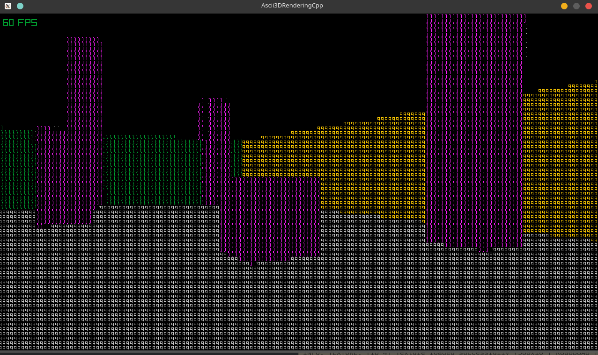

# Ascii3DRenderingCpp

Ce projet est un prototype de moteur 3D rendu en ASCII, écrit en C++ avec raylib.  
La scène 3D (cubes, sol, caméra FPS) est rendue dans une texture, puis convertie en caractères ASCII via un shader de post‑processing.

## Aperçu

*(Image de démonstration à insérer ici)*

## Fonctionnalités

- Rendu 3D temps réel avec caméra à la première personne (raylib + rcamera).
- Conversion de la scène 3D dans un `RenderTexture` de basse résolution.
- Shader GLSL qui transforme l’image en ASCII en fonction de la luminosité.
- Palette de caractères ASCII triée par densité pour un rendu lisible.
- Code relativement simple, idéal comme base pour un petit jeu ou un moteur expérimental.

## Dépendances

- **Langage** : C++
- **Librairie graphique** : [raylib](https://www.raylib.com/)
- Compilateur C++ compatible C++17 (g++, clang, MSVC, etc.)

## Compilation

g++ main.cpp -o Ascii3DRender
-std=c++17 -O2
-lraylib -lm -lpthread -ldl -lrt -lX11

### Contrôles

- Souris : regarder autour.
- Z / Q / S / D ou WASD : déplacer la caméra.
- Échap : quitter l’application.

## Structure du projet

- `main.cpp`  
  - Initialisation de la fenêtre raylib.
  - Configuration de la caméra 3D à la première personne.
  - Génération de la scène (cubes aléatoires, sol, murs).
  - Rendu dans un `RenderTexture` puis application du shader ASCII.

- `ascii_real.fs` / `ascii_simple.fs`  
  - Shader de post‑processing :
    - Lit la texture de la scène 3D.
    - Calcule la luminosité de blocs de pixels.
    - Sélectionne un caractère ASCII dans une texture de font.
    - Produit l’image finale en ASCII.

- (Optionnel) `Ressources/ascii_font.png`  
  - Atlas de caractères ASCII en niveaux de gris, alignés horizontalement, utilisé par le shader.

## Idées d’amélioration

- Ajouter plusieurs sources de lumière et un shader d’éclairage plus avancé.
- Gérer différentes résolutions ASCII et tailles de caractères.
- Ajouter des éléments de gameplay (ennemis, projectiles, interface ASCII).
- Mode “terminal” avec palette de couleurs limitée (8 ou 16 couleurs).
- Exporter des captures d’écran ASCII en texte brut ou PNG.

## Licence

Indique ici la licence souhaitée, par exemple :

- MIT
- GPL‑3.0
- Apache‑2.0

